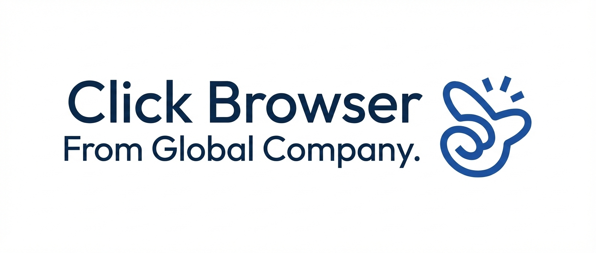

# Click Browser - The Agent 🚀

**Click Browser from Global Company**



[📥 Download Source Code (ZIP)](./click-browser-source.zip)

## 🌟 Overview
**Click Browser** is a powerful, modern, and open-source web browser built on top of **Chromium** (via Electron). It is designed to be more than just a browser; it is an **AI-powered Agent** that assists users in their daily web activities.

Developed by **Global Company**, this project aims to provide a clean, fast, and highly customizable browsing experience with a built-in AI sidebar that developers can easily extend.

## ✨ Features
- **Chromium Core**: Fast and secure browsing experience.
- **Modern UI**: Sleek, minimalist design with a focus on usability.
- **Integrated AI Agent**: A dedicated sidebar for AI interactions.
- **Open Source**: Developers can modify the code, add their own APIs, and customize the AI logic.
- **RTL Support**: Fully compatible with Arabic and other Right-to-Left languages.

## 🛠️ For Developers
This project is built as a "Raw Code" (كود خام) base. Developers are encouraged to:
1. **Plug in AI APIs**: Easily connect OpenAI, Anthropic, or local LLMs.
2. **Customize UI**: Modify the CSS to match any branding.
3. **Extend Functionality**: Add browser extensions or custom plugins.

### How to Run
1. Clone the repository:
   ```bash
   git clone https://github.com/your-username/click-browser.git
   ```
2. Install dependencies:
   ```bash
   npm install
   ```
3. Start the browser:
   ```bash
   npm start
   ```

## 🖼️ Project Identity
> **Click Browser: The Agent from Global Company**

---
*This project is open-source and maintained by the community. Feel free to contribute!*
